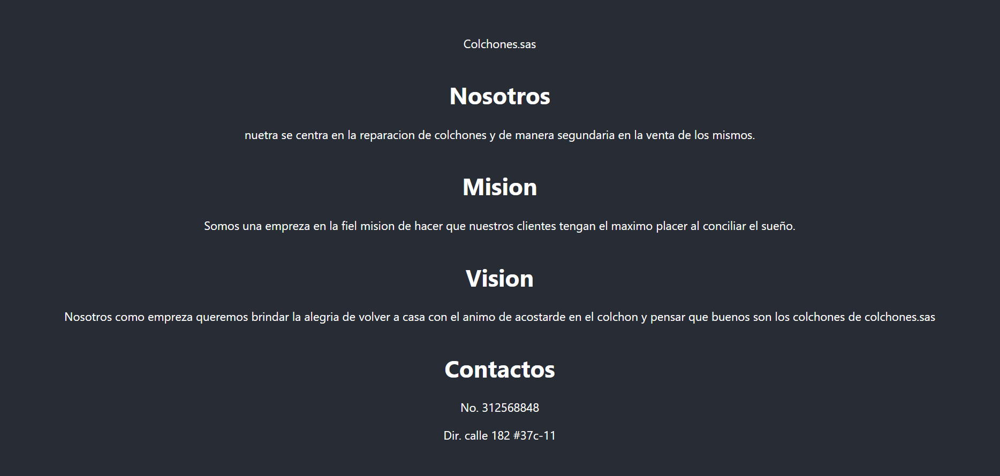

# Parcial 3

Descarga y creación de la pagina en el framework

## Creación en la carpeta y activacion de la misma

Podemos hacerlo desde un editor de codigo o de la consola del equipo&#x20;

Abrimos el editor y con el siguiente codigo cremos y instalamos react

<mark style="background-color:orange;">PS C:\Users\nicol\pagina1-react></mark> <mark style="background-color:orange;"></mark><mark style="background-color:orange;">**npx create-react-app pagina1-react**</mark>

con eso ya tenemos la estructura basica.

## Código

Creación de los componentes .

## SRC

Creamos una nueva carpeta en src llamada componentes(opcional) en el cual crearemos las los apartados solicitados que en este caso son acerca de nosotros, misión y visión de la compañía y contáctenos.

utilisando la estructura que nos da react creamos la funciones correspondientes.

```javascript
import React from 'react'

export default function Nosotros () {
  return (
    <div>
        <h1>Nosotros</h1>
        <p>nuetra se centra en la reparacion de colchones y de manera segundaria en la venta de los mismos.</p>
    </div>
  )
}

```

```javascript
import React from 'react'

export default function Mision () {
  return (
    <div>
    <h1>Mision</h1>
     <p>Somos una empreza en la fiel mision de hacer que nuestros clientes tengan el maximo placer al conciliar el sueño.</p>
    </div>
  )
}
```

```javascript
import React from 'react'

export default function Vision () {
  return (
    <div>
        <h1>Vision</h1>
        <p>Nosotros como empreza queremos brindar la alegria de volver a casa con el animo de acostarde en el colchon y pensar que buenos son los colchones de colchones.sas</p>
    </div>
  )
}

```

```javascript
import React from 'react'

export default function Contactos () {
  return (
    <div>
        <h1>Contactos</h1>
        <p>No. 312568848</p>
        <p>Dir. calle 182 #37c-11</p>
    </div>
  )
}

```

## Unificación en la pagina central

cuando terminamos de crear los componentes lo que sigue es colocar las funciones en el apartado app.js en nuestro caso para que así nos retorne los resultados es la web.

```javascript
import logo from './logo.svg';
import './App.css';
import Nosotros from './components/Nosotros';
import Mision from './components/Mision';
import Vision from './components/Vision';
import Contactos from './components/Contactos';


function App() {
  return (
    <div className="App">
      <header className="App-header">
        
        <p>
          Colchones.sas
        </p>
        <Nosotros/>
        <Mision/>
        <Vision/>
        <Contactos/>
      </header>
    </div>
  );
}

export default App;

```

### Estilos

El resultado puede ser variar dependiendo de los estilos que utilicemos en esta caco no utilizaremos nada aparte de lo que ya viene predeterminado.

## Resultado Final

<figure><figcaption></figcaption></figure>

